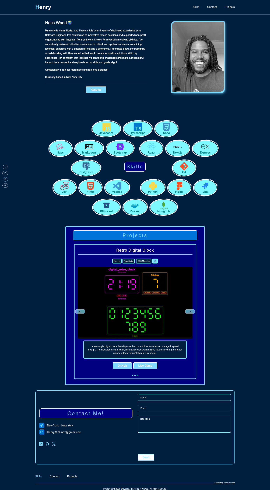

# Henry Nuñez Portfolio 2025

A modern, responsive portfolio website showcasing my projects, skills, and professional journey as a software developer.

## 📱 Responsive Design

<table>
  <tr>
    <td align="center"><h3>Desktop View</h3></td>
    <td align="center"><h3>Tablet View</h3></td>
    <td align="center"><h3>Mobile View</h3></td>
  </tr>
  <tr>
    <td align="center"></td>
    <td align="center"></td>
    <td align="center"></td>
  </tr>
</table>

## 🌐 Live Demo

Visit my portfolio: [henry-nunez.com](https://www.henry-nunez.com)

## ✨ Features

- **Dynamic Theming** - Multiple color themes with persistent user preferences
- **Project Showcase** - Interactive carousel displaying featured projects
- **Responsive Design** - Optimized for all devices from mobile to desktop
- **Contact Form** - Secure form with reCAPTCHA protection and database storage
- **Admin Dashboard** - Professional admin panel for managing messages and analytics
- **Modern UI** - Clean, professional design with smooth animations
- **Accessibility** - Designed with accessibility in mind
- **Dark Mode** - Support for light/dark preferences
- **Blog Section** - Tech articles and tutorials with markdown support

## 🛠️ Technology Stack

### Frontend

- **Framework**: Next.js 15 (App Router)
- **Language**: TypeScript
- **Styling**: CSS Modules with dynamic theming
- **Components**: React 19 with custom components
- **Icons**: RemixIcon and Devicon

### Backend

- **API Routes**: Next.js App Router API endpoints
- **Database**: MongoDB for message storage and analytics
- **Security**: Google reCAPTCHA for form protection
- **Admin Panel**: Password-protected admin dashboard for managing messages

### Development & Deployment

- **Hosting**: Vercel
- **Version Control**: Git
- **Package Management**: npm
- **Environment**: Environment variables for secure API key management

## 🚀 Getting Started

### Prerequisites

- Node.js (v16+)
- npm or yarn

### Installation

1. Clone the repository

   ```bash
   git clone https://github.com/henrythedev90/portfolio_2024.git
   cd portfolio_2024
   ```

2. Install dependencies

   ```bash
   npm install
   ```

3. Create a `.env.local` file in the root directory with the following variables:

   ```
   NEXT_PUBLIC_RECAPTCHA_SITE_KEY=your_recaptcha_site_key
   RECAPTCHA_SECRET_KEY=your_recaptcha_secret_key
   MONGODB_URI=your_mongodb_connection_string
   MONGODB_DB_NAME=portfolio
   ADMIN_PASSWORD=your_secure_admin_password
   ```

   **Note**: Get your MongoDB connection string from [MongoDB Atlas](https://www.mongodb.com/cloud/atlas) or use a local MongoDB instance.

4. Start the development server

   ```bash
   npm run dev
   ```

5. Open [http://localhost:3000](http://localhost:3000) in your browser

## 📝 Project Structure

- `/src/app` - Next.js App Router pages and layout
- `/src/app/components` - Reusable React components
- `/src/app/_lib` - Utility components and functions
- `/src/app/api` - API routes for backend functionality
- `/src/app/admin` - Admin dashboard pages (password-protected)
- `/src/app/lib` - Database connection utilities
- `/public` - Static assets (images, icons, etc.)
- `/src/app/blog` - Blog posts and related components

## 🔐 Admin Panel

The portfolio includes a professional admin dashboard for managing contact form messages:

### Accessing the Admin Panel

1. Navigate to `/admin/login` (or `/admin` which redirects to messages)
2. Enter your admin password (set in `ADMIN_PASSWORD` environment variable)
3. Access the messages dashboard at `/admin/messages`

### Admin Features

- **Message Management**: View, filter, and organize all contact form submissions
- **Read/Unread Status**: Mark messages as read or unread
- **Archive**: Archive messages to keep your inbox clean
- **Starred/Priority**: Mark important messages with stars
- **Project Tags**: Tag messages by project type (Web Development, Mobile App, etc.)
- **Contacted Status**: Track which messages you've responded to
- **Analytics Dashboard**: 
  - Device type breakdown (mobile vs desktop)
  - Resume download statistics
  - Message trends over time
- **Email Copy**: Quick copy-to-clipboard for email addresses
- **CSV Export**: Export all messages to CSV for external analysis

### Setting Up Admin Access

The admin panel uses cookie-based authentication. Set a strong password in your `.env.local` file:

```
ADMIN_PASSWORD=your_secure_password_here
```

**Security Note**: In production, consider using a more robust authentication system or environment-specific passwords.

## 📚 Blog Structure

The blog section includes:

- Markdown-based blog posts
- Syntax highlighting for code snippets
- Categories and tags for better organization
- Search functionality
- Responsive reading experience

## 🔄 Future Updates

- Blog section for tech articles and tutorials
- Integration with GitHub API for automatic project updates
- Additional interactive elements and animations
- Enhanced SEO optimization

## 📬 Contact

Feel free to reach out for collaborations or inquiries:

- **Email**: henry.s.nunez@gmail.com
- **LinkedIn**: [Henry Nuñez](https://www.linkedin.com/in/henrysaulnunez/)
- **GitHub**: [henrythedev90](https://github.com/henrythedev90)

## 📄 License

This project is licensed under the MIT License - see the LICENSE file for details.

---

&copy; 2024 Henry Nuñez. All Rights Reserved.
